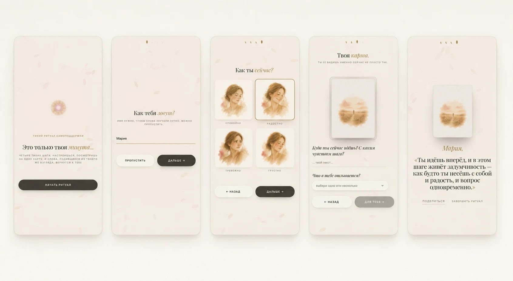

<div align="center">
  
</div>

# Ежедневный комплимент

Тихий ритуал самоподдержки. Минималистичное React-приложение, в котором
человек проходит четыре шага — имя, настроение, метафорическая карта с
вопросом — и получает короткое подношение, написанное Claude на основе
его же ответов.

## Стек

- React 19 + TypeScript + Vite 6
- Tailwind CSS 4
- Motion (анимации лепестков-индикатора, переходы шагов)
- Anthropic Claude (Haiku 4.5) через серверный endpoint `/api/synthesis`
- Vercel — продакшен-хостинг и serverless API

## Как устроен ритуал

Один экран `RitualFlow` (оркестратор) с пятью под-экранами:

1. **Интро** — фибоначчи-цветок + кнопка «Начать ритуал»
2. **Имя** — необязательное, ритуал работает и без него
3. **Настроение** — одна из четырёх акварельных эмоций (calm, happy, anxious, sad)
4. **Карта** — случайная карта из колоды 66 акварельных образов, у каждой
   своя «Заметка» — рефлексивный вопрос. Пользователь отвечает текстом
   и выбирает теги-эмоции из словаря на 20 слов.
5. **Подношение** — Claude собирает 1-2 предложения, опираясь на состояние,
   карту, ответы и выбранные теги. Имя выводится накртным курсивом сверху
   как обращение.

Колода (карты + вопросы) описана в [public/mak_deck.md](public/mak_deck.md).
Источник правды для `src/lib/deck.ts`.

## Структура

```
src/
├── App.tsx                       # внешний контейнер, localStorage
├── screens/
│   ├── RitualFlow.tsx            # оркестратор шагов + state
│   └── steps/
│       ├── IntroStep.tsx
│       ├── NameStep.tsx
│       ├── MoodStep.tsx
│       ├── CardStep.tsx          # карта + вопрос + textarea + feel-trigger
│       └── OfferingStep.tsx      # loading / error / финальное подношение
├── components/
│   ├── FeelTagsSheet.tsx         # bottom-sheet модалка с тегами
│   ├── MACCard.tsx               # картинка-карта в рамке
│   ├── PetalsBackground.tsx      # canvas-лепестки на фоне
│   ├── PhyllotaxisOrb.tsx        # фибоначчи-цветок (интро + лоадинг)
│   └── ui.tsx                    # Stage, StepIndicator, LoadingDots, MicroLabel
├── lib/
│   ├── deck.ts                   # 66 карт с вопросами
│   ├── feelings.ts               # 20 emotion-тегов (alphabetical)
│   ├── moods.ts                  # 4 настроения с акварельными иконками
│   ├── date.ts                   # dayOfYear()
│   ├── motionPresets.ts          # fadeStep transition
│   └── storage.ts                # readLS / writeLS обёртки
├── styles/
│   └── typography.css            # 4 type-роли (display, body, caption, micro)
└── index.css                     # CSS-переменные, glass-классы, кнопки

api/
└── synthesis.ts                  # Vercel serverless → Anthropic API

public/
├── pictures/                     # 66 WebP MAC-карт (≈30 КБ каждая)
├── emotions/                     # 4 WebP эмоции для step 2
└── mak_deck.md                   # источник вопросов + image prompts
```

## Команды

```bash
npm install
npm run dev        # vite на http://localhost:3000
npm run build      # prod-сборка в dist/
npm run preview    # просмотр prod-билда локально
npm run lint       # tsc --noEmit (strict)
```

## API

`POST /api/synthesis` принимает:

```ts
{
  name: string;
  mood: 'calm' | 'happy' | 'anxious' | 'sad';
  card: { title: string; question: string };
  see: string;       // ответ пользователя на вопрос карты
  feel: string;      // comma-joined список тегов
}
```

Отвечает `{ offering: string }` или `{ error: string }` со статусом 502
при ошибке Anthropic.

В dev-режиме endpoint мокается Vite-middleware с задержкой 1.2 сек и
случайным подношением из небольшого набора — это позволяет дизайнить
finale без обращений к реальному API.

## Окружение

`.env.local`:

```
ANTHROPIC_API_KEY=sk-ant-...
```

## Локальное хранилище

Один ритуал в день. Все ключи под префиксом `compliment:`:

- `compliment:name` — имя (живёт между днями)
- `compliment:onboardedDay` — день года, в который завершён ритуал
- `compliment:todayMoodId`, `:todaySee`, `:todayFeel` — ответы пользователя
- `compliment:todayCardId` — id выпавшей карты
- `compliment:todayOffering` — финальный текст от Claude

Если зайти повторно в тот же день после завершения — показывается то же
подношение с той же картой. Кнопка «Завершить ритуал» очищает день.
До завершения карта рандомная при каждом заходе.

## Оптимизация картинок

Скрипт [scripts/optimize-images.mjs](scripts/optimize-images.mjs)
конвертирует все PNG в `public/pictures/` и `public/emotions/` в WebP
с ресайзом до разумного размера. Запуск:

```bash
node scripts/optimize-images.mjs
```

После запуска обнови расширения `.png` → `.webp` в `src/lib/deck.ts` и
`src/lib/moods.ts`.

## Деплой

Любой push на main триггерит Vercel. Serverless-функция `api/synthesis.ts`
автоматически подцепляет `@vercel/node` типы и `ANTHROPIC_API_KEY` из
Project Settings.
